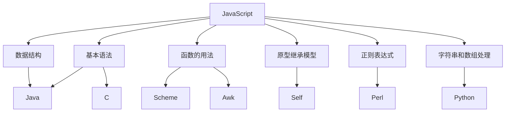
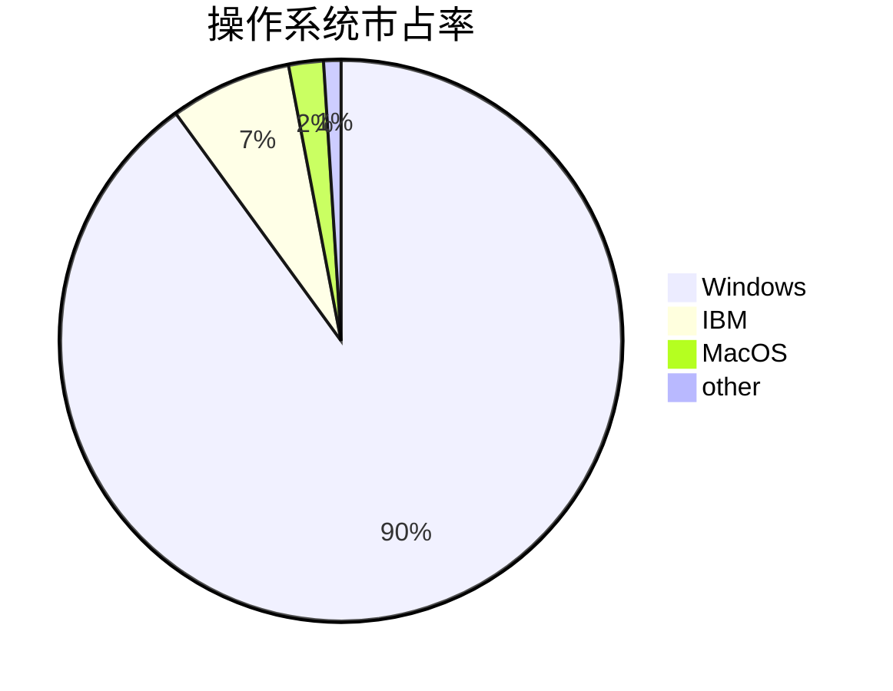
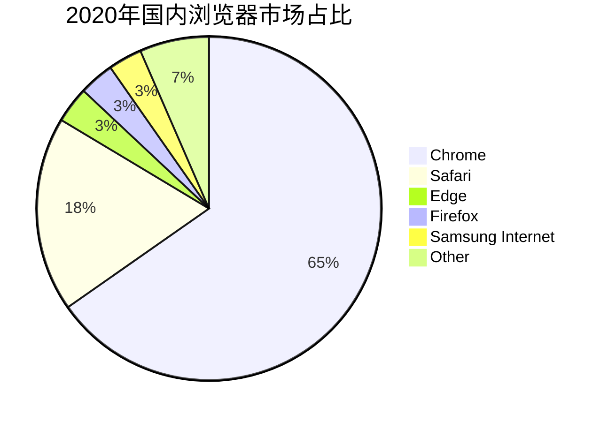
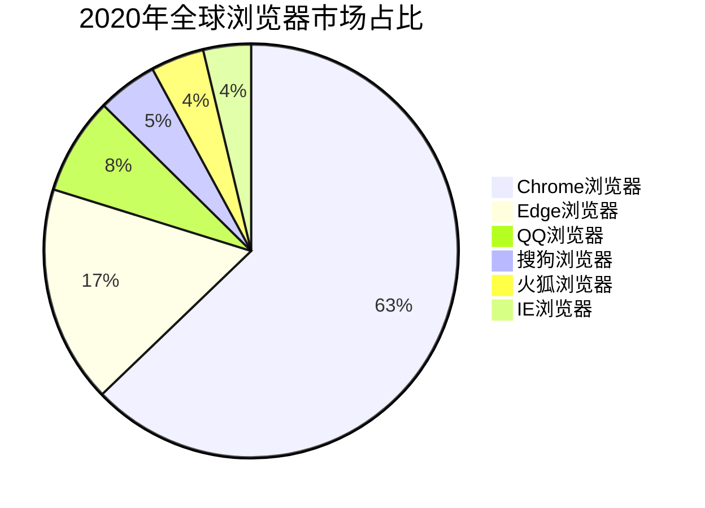
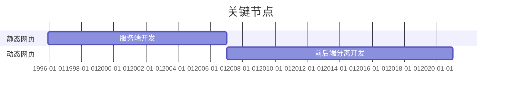
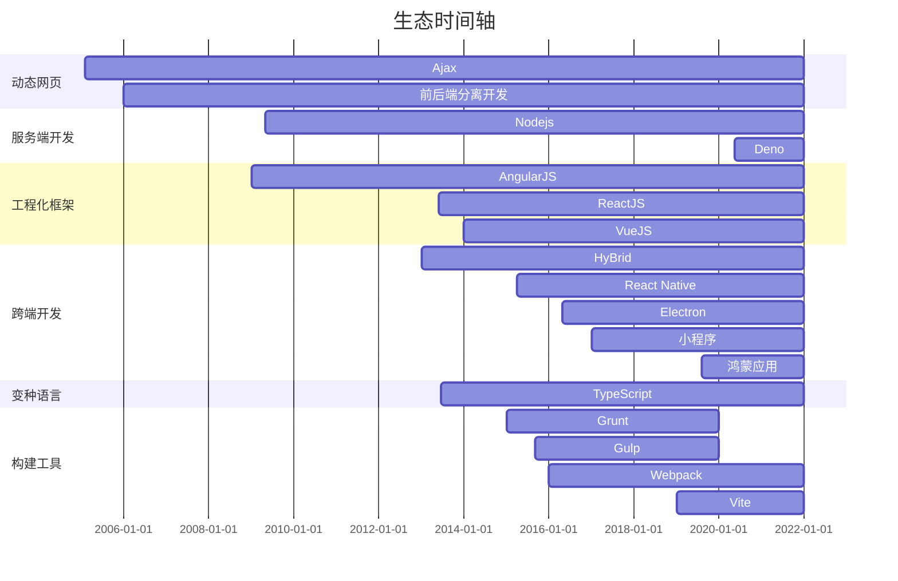

# 前端开发技术演进

---

# 洪荒时代

JavaScript 因为互联网而生,紧跟着浏览器的出现而问世. 回顾它的历史,就要从浏览器的历史讲起。


<style>
h1 {
  background-color: #2B90B6;
  background-image: linear-gradient(45deg, #4EC5D4 10%, #146b8c 20%);
  background-size: 100%;
  -webkit-background-clip: text;
  -moz-background-clip: text;
  -webkit-text-fill-color: transparent; 
  -moz-text-fill-color: transparent;
}
*:focus{
  outline:none
}
</style>

---

# 浏览器的诞生

<div v-click class="flex justify-center items-center">
  <div class="flex-auto leading-relaxed indent">1990年底，欧洲核能研究组织（CERN）科学家 蒂姆·伯纳斯·李(Tim Berners-Lee)，在全世界最大的电脑网络——互联网的基础上，发明了万维网（World Wide Web），从此可以在网上浏览网页文件。最早的网页只能在操作系统的终端里浏览，也就是说只能使用命令行操作，网页都是在字符窗口中显示，这当然非常不方便。</div>
  
</div>

<div v-click class="flex justify-center items-center">
  <div class="flex-auto leading-relaxed indent">1992年底，美国国家超级电脑应用中心（NCSA）开始开发一个独立的浏览器，叫做 Mosaic。这是人类历史上第一个浏览器，从此网页可以在图形界面的窗口浏览。<p>1994年10月，NCSA 联合风险投资家成立了 Mosaic 通信公司，不久后改名为 <b>网景（Netscape）</b>。这家公司的方向，就是在 Mosaic 的基础上，开发面向普通用户的新一代的浏览器 <b>网景浏览器。</b></p><p>1994年12月，Navigator 发布了1.0版，市场份额一举超过90%。</p></div>
  
</div>

---

# 天地初开

中国历史，传说中是始于盘古开天辟地，前端的历史始于 javascript 的诞生

<p v-click class="leading-relaxed indent">网景公司很快发现，网景浏览器需要一种可以嵌入网页的脚本语言，用来控制浏览器行为。当时，网速很慢而且上网费很贵，有些操作不宜在服务器端完成。比如，如果用户忘记填写“用户名”，就点了“发送”按钮，到服务器再发现这一点就有点太晚了，最好能在用户发出数据之前，就告诉用户“请填写用户名”。这就需要在网页中嵌入小程序，让浏览器检查每一栏是否都填写了。网景公司急于解决浏览器与用户交互这个问题。当时解决这个问题有两个办法，一个是采用现有的语言，比如Python、Tcl、Scheme等等，允许它们直接嵌入网页。另一个是发明一种全新的语言。</p>

<p v-click class="leading-relaxed indent">1994年正逢太阳微系统公司（Sun）公司的 <b>Java</b> 语言问世，市场推广活动非常成功。网景公司决定与太阳公司合作推出Java的轻量版新语言</p>

<div v-click class="flex justify-center items-center">
  <div class="flex-auto leading-relaxed indent"><p>1995年5月，网景公司员工布兰登·艾奇(Brendan Eich) 只用了10天，就设计完成了这种语言的第一版LiveScript。它是一个大杂烩，语法有多个来源。</p><p>网景公司的这种浏览器脚本语言，最初名字叫做 Mocha，1995年9月改为 LiveScript。12月，网景公司与太阳微系统公司（Java 语言的发明者和所有者）达成协议，后者允许将这种语言叫做 JavaScript。这样一来，网景公司可以借助 Java 语言的声势，而太阳微系统公司公司则将自己的影响力扩展到了浏览器。</p></div>
  
</div>

---

# 缝合怪 JavaScript

高情商说法,站在巨人肩膀上发光发热

<v-click>

- 基本语法：借鉴 C 语言和 Java 语言。
- 数据结构：借鉴 Java 语言，包括将值分成原始值和对象两大类。
- 函数的用法：借鉴 Scheme 语言和 Awk 语言，将函数当作第一等公民，并引入闭包。
- 原型继承模型：借鉴 Self 语言。
- 正则表达式：借鉴 Perl 语言。
- 字符串和数组处理：借鉴 Python 语言。

</v-click>

<div v-click class="fixed bottom-inset-1 right-inset-0">



</div>

---

<p v-click class="leading-relaxed indent">所以，Javascript 语言实际上是两种语言风格的混合产物----(简化的)函数式编程+(简化的)面向对象编程，并且是解释型,弱类型语言。</p>

<p v-click class="leading-relaxed indent">由于设计时间太短，语言的一些细节考虑得不够严谨，导致后来很长一段时间，Javascript 写出来的程序混乱不堪。如果 Brendan Eich 预见到，未来这种语言会成为互联网第一大语言，他或许会认真设计JavaScript</p>

<p v-click class="leading-relaxed indent">它的优秀之处并非原创，它的原创之处并不优秀.</p>

<p v-click class="leading-relaxed indent">不管怎么样，javascript 诞生了，它的设计之初其实很简单，就是为了解决浏览器上表单提交的人机交互，而作为一种脚本语言，它天生的设计缺陷为后来的大型应用程序开发，留下了隐患。详细可以参考阮一峰的<a target="_blank" href="http://www.ruanyifeng.com/blog/2011/06/10_design_defects_in_javascript.html">这篇博客</a></p>

<p v-click class="leading-relaxed indent">1995年12月4日，网景公司与太阳微系统公司联合发布了 JavaScript 语言，对外宣传 JavaScript 是 Java 的补充，属于轻量级的 Java，专门用来操作网页。</p>

<p v-click class="leading-relaxed indent">1996年3月，Navigator 2.0 浏览器正式内置了 JavaScript 脚本语言。</p>

---

# JavaScript的坑 

<div class="flex justify-around items-center h-full">

<v-clicks>

```ts {all|2|all}
　　function foo(){
　　　　return
　　　　　　{
　　　　　　　　i=1
　　　　　　};
　　}

   foo();
```
```ts {1|3|5|7|all}
　　alert(1+10); // 11

　　alert("1"+"10"); // 110

　　alert(1+"10"); // 110

　　alert("10"+1); // 101
```
```ts {1|3|5|7|9|all}
　　"" == "0" // false

　　0 == "" // true

　　0 == "0" // true

　　false == "false" // false

　　false == "0" // true
```

</v-clicks>
</div>

---

# 浏览器大战

抢占流量入口

<p v-click class="leading-relaxed indent">1994年网景浏览器发布后大部分人也不知道如何开发浏览器的价值。但是今天的我们能看到，浏览器这种东西，其实是一种流量入口，掌控了流量入口，那就是掌控了互联网。所以你会看到今天的头条系、腾讯系、阿里系都在发力掌控流量入口，各种战术层出不穷。</p>

<p v-click class="leading-relaxed indent">网景发布浏览器后还想依托它开发一个系统。微软意识到网景正在威胁它,也意识到浏览器可能就是互联网的未来</p>

<p v-click class="leading-relaxed indent">在位于繁华西雅图的微软总部，微软眼睁睁看着网络的机遇失之交臂，开始了大型动员令。这家软件巨头有资金、有人力、也有品牌做支撑来逆转处境。因此，在1995年秋天，他们发布了一个浏览器：IE浏览器（The Internet Explorer）,微软与网景战争开始。</p>


---

# 浏览器大战，微软崛起，网景死亡

万恶的 IE 浏览器

<p v-click class="indent">先看看 90 年代操作系统情况</p>
<arrow v-after x1="340" y1="140" x2="650" y2="140" color="#564" width="3" arrowSize="1" />
<div v-after class="fixed top-20 left-40">



</div>

<div v-click class="indent w-120">
  <p>1996年8月，微软发布了IE3，并支持JavaScript,势必要来瓜分浏览器的这份大蛋糕，而网景的地位也开始被撼动。与此同时，多家公司都开始开发和推广自己的浏览器，而浏览器的脚本都不太一样，而来势汹汹的微软更成为了网景的头敌</p>
  <p>微软疯狂迭代ie浏览器完全不顾及W3C协议规范</p>
  <p class="text-xs italic text-gray-500 indent">W3C（万维网联盟）创建于 1994 年，是 Web 技术领域最具权威和影响力的国际中立性技术标准机构。如HTML,XML技术标准</p>
</div>
  <p v-click class="indent">网景出招希望建立浏览器语言标准对抗微软,在1996年11月向ECMA（欧洲计算机制造商协会）提交语言标准，由于版权原因，JS的标准语言并不叫JavaScript，而是ECMAScript。然而微软的商业决策出奇制胜 —— IE浏览器免费使用，并将IE浏览器捆绑进Windows，（当时的网景浏览器收费45美元。）网景被大创，其市占率从1990年代中期的90%跌落至2006年底的不到1%。</p>
  
---

<p class="indent">由于微软的捆绑销售措施，触犯了美国的反垄断相关法律，美国在线对微软提出反垄断诉讼，微软此时采取了持久战的策略。</p>
<p class="indent">它知道网景公司已经时日无多，3年后，也就是2003年5月，微软同意赔偿网景公司7.5亿美元。2003年7月，网景解散，就在解散的当天，Mozilla基金会成立。</p>
<p class="indent">Mozilla基金会直白点的目标就是，联合世界上的有志于搞死微软的公司搞死微软，但这个目标至今没有实现。 2007 年，网景浏览器停止开发，2008 年，停止了对网景浏览器的技术支持，当年的浏览器帝国正式退出了历史的舞台。随着Windows XP在国内的盛行，直至2010年，IE6依然在国内占据主流地位，而这也变成国内前端工程师的噩梦。</p>
<p class="indent">第二次浏览器大战在2006年,IE7和Mozilla FireFox2发布,微软凭借捆绑策略再胜。</p>
<p class="indent">第三次浏览器大战在2008年开始Google推出Chrome浏览器,凭借对开发者友好,性能更强。诞生出大量Chrome插件,一举打败微软。直到现在windows 10系统内置edge浏览器换装使用Chrome内核。</p>
<p class="indent">到现在浏览器市场份额Chrome占据60%,国内很多浏览器均使用Chrome内核二次开发,如360浏览器,搜狗浏览器等等...</p>

---

<div class="flex flex-col justify-center items-center h-full">





[更多详细统计访问 statcounter](https://gs.statcounter.com/)

</div>

---

# JavaScript 高速发展

蒸汽时代

<p v-click class="indent">2005 年2月，杰西·詹姆士·贾瑞特（Jesse James Garrett）发表了一篇名为《Ajax：一种Web应用程序开发的新方法》的文章后，Ajax被挖掘出，大家才开始重视起这技术的应用。使用Ajax技术网页应用能够快速地将增量更新呈现在用户界面上，而不需要重载（刷新）整个页面，这使得程序能够更快地回应用户的操作。</p>
<p v-after class="indent">在此之前没有前后端分离开发的概念。服务端开发示意图: <my-dialog/></p>
<p v-after class="indent">在此之后前后端分离开发示意图:<my-dialog url="/client_development.png" headText="前后端分离开流程图"/></p>

<v-click>



</v-click>

---

# Node.js

现代前端开发基石

<v-click>
<p class="indent">2009年5月,Ryan Dahl在GitHub上发布了最初版本Node.js包</p>
<p class="indent">Node.js® 是一个基于 Chrome V8 引擎 的 JavaScript 运行时</p>

</v-click>

<v-clicks>

## Nodejs 能做什么?

<p class="indent">nodejs核心科技:<my-dialog url="/nodejs.png" headText="nodejs核心科技"/></p>

1. web 服务端框架: express,koa
2. im 及时聊天: Socket.IO
3. 前端构建工具: grunt/gulp/bower/webpack ...
4. 跨平台打包工具: nw.js/electron/cordova
5. 编辑器: webpack/vscode
6. npm 依赖包管理器

</v-clicks>

---

<div class="flex flex-nowrap justify-center items-center h-full">
<logos-v8  class="text-18xl"/>
<div class="text-2xl w-md"><h1 class="text-center">什么是V8</h1><div class="indent">V8 是使用 C++编写的 Google 开源高性能 JavaScript 和 WebAssembly 引擎。V8 第一个版本随着第一个版本的 Chrome 于 2008 年 9 月 2 日发布</div></div>
</div>

---

<div class="flex flex-nowrap justify-center items-center h-full">
<logos-v8  class="text-18xl"/>
<div class="text-2xl w-md"><h1 class="text-center">V8主要职责</h1><div class="indent">是一个接收JavaScript代码，编译代码然后执行C++程序，编译后的代码可以在多种操作系统多种处理器上运行</div> <my-dialog url="/v8run.gif" headText="V8主要职责"/></div>
</div>

---

# V8 如何编译和执行 JS 代码


---

<div class="flex flex-nowrap justify-center items-center h-full">
<logos-v8  class="text-18xl"/>
<div class="text-2xl w-md">
<h1 class="text-center">哪些程序用到V8</h1>

1. [Chrome](https://www.google.cn/chrome/) 浏览器的 JS 引擎是 V8
2. [Nodejs](https://nodejs.org/zh-cn/) 的运行时环境是 V8
3. [electron](https://www.electronjs.org/) 的底层引擎是 V8

</div>
</div>

---

<div class="flex flex-nowrap justify-center items-center h-full">

<div class="text-2xl w-md m-5"><h1 class="text-center">移动端诞生</h1><div class="indent">2010年6月8日凌晨1点,史蒂夫-乔布斯在美国发布iPhone4,自此开启移动互联网时代.</div></div>
</div>

---

# 现代前端开发

蓬勃发展

<p v-click class="indent my-1">随着移动端,nodejs的发展,脚手架生成,打包脚本,语法风格检测,环境变量插入,代码复杂度检测,CLI构建工具如雨后春笋,遍地开花.</p>
<div v-after class="flex justify-around">
<logos-vue />
<logos-angular-icon  />
<logos-react />
<logos-bootstrap />
<logos-deno />
<logos-grunt />
<logos-gulp />
<logos-webpack />
<logos-eslint />
<logos-typescript-icon />
<logos-babel />
<logos-nestjs />
<logos-npm-icon />
<logos-nodejs-icon />
<logos-reactivex />
<logos-require />
<logos-sass />
<logos-element />
<logos-tailwindcss-icon  />
<logos-vitejs />
<logos-electron />
</div>
<p v-click class="indent my-1">这段时期还诞生的TypeScript,它是微软开发的一个开源的编程语言，通过在JavaScript的基础上添加静态类型定义构建而成。</p>
<p v-click class="indent my-1 flex">现在前端能够使用JavaScript具备跨端开发能力。<logos-android-icon /><logos-apple/><logos-microsoft-windows /> <vscode-icons:folder-type-macos/><logos-linux-tux /></p>
<p v-click class="indent my-1">2017年1月9日，张小龙在2017微信公开课Pro上发布的微信小程序正式上线.其开发语言仍然是基于JavaScript HTML CSS,后端云开发基于nodejs,随后钉钉小程序,支付宝小程序等等...都采用相同开发语言</p>
<p v-click class="indent my-1">2021年6月2日晚，华为正式发布HarmonyOS 2,鸿蒙应用app开发语言也是基于JavaScript.</p>

---

# JavaScript生态




---

# 前端框架先锋 AngularJS


---

# 现代前端架构元素


---

# 现代参考架构


